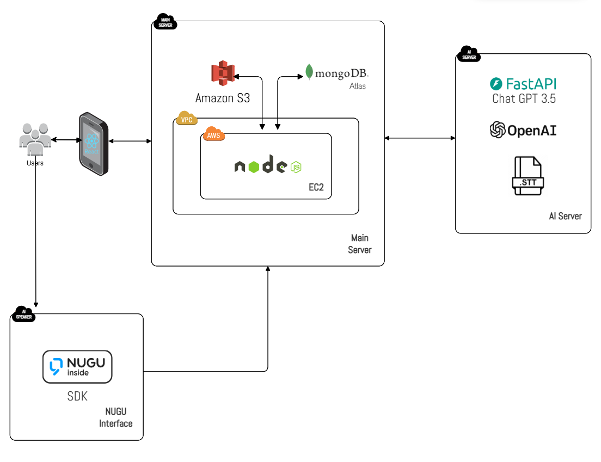

# 💖 HeartLink
**An AI Family Platform for Rebuilding Connection**  
Connect generations through voice recognition and AI-enhanced social networking!

  
  
## 🎥 Demo Video (🔗 Click Below!)
🔗 **App Demo Video** : https://youtu.be/DZnuOD6o2J8

🔗 **LG StandbyME x NUGU Demo Video** : https://youtu.be/ExzJVdnNvAs

🔗 **LG StandbyME x NUGU Scenario Video** : https://youtu.be/n3aJk-IJuhE
  
## 📌 Proposal
HeartLink is a group-centric SNS platform that breaks down intergenerational communication barriers through a voice interface. Its real-time group feed feature converts AI voice recognition into text and generates images based on that text, allowing users to easily share their daily lives through simple voice inputs. This is particularly beneficial for elderly users who are less familiar with digital devices, enabling them to communicate naturally. HeartLink’s mission is to bridge family communication gaps and foster meaningful connections. Additionally, the platform features a virtual pet, CLOi, that grows in level based on SNS activity and interacts with users like a generative chatbot. Accessible through LG StandbyME, HeartLink combines cutting-edge AI technology with the warmth of family and friendship connections.
  
HeartLink은 음성 인터페이스를 통해 세대 간의 소통 장벽을 허물어주는 그룹 중심의 SNS 플랫폼입니다. 이 플랫폼의 실시간 그룹 피드 기능은 AI 음성 인식을 텍스트로 변환하고, 해당 텍스트를 기반으로 이미지를 생성하여 사용자들이 간단한 음성 입력만으로 일상을 쉽게 공유할 수 있도록 돕습니다. 이는 디지털 기기에 익숙하지 않은 고령 사용자들에게 특히 유용하며, 자연스러운 소통을 가능하게 합니다. HeartLink의 사명은 가족 간의 소통 격차를 줄이고, 의미 있는 연결을 강화하는 데 있습니다. 또한, 플랫폼은 SNS 활동에 따라 성장하며 챗봇 형식으로 대화를 할 수 있는 가상 펫 CLOi를 제공합니다. LG StandbyME를 통해 접근할 수 있는 HeartLink는 최첨단 AI 기술을 통해 가족 및 친구의 따뜻한 연결을 위한 새로운 소통 플랫폼입니다.
     
## 🤖 Main Function : AI 자동 피드 생성 
HeartLink는 AI 중심의 SNS 플랫폼으로, 자동 피드 생성 기능을 통해 사용자의 일상을 더욱 손쉽게 기록하고 공유할 수 있습니다. 

---

### 👉 **음성 인식(STT)**

HuggingFace의 사전 학습된 Whisper 모델을 활용하여 사용자의 음성을 정확히 텍스트로 변환합니다. 한국어 데이터를 기반으로 파인튜닝을 진행해 오류율을 약 4.3%로 낮췄습니다.

### 👉 이미지 생성

OpenAI의 DALLE 3 모델을 사용하여 텍스트 기반 이미지를 생성합니다. 사용자가 입력한 텍스트에서 AI가 실시간으로 창의적인 이미지를 만들어 줍니다.

### 👉 음성으로 피드 작성

LG의 누구 스피커와 연동하여 사용자는 음성 명령만으로 피드를 작성하고, 자동으로 텍스트와 이미지를 생성해 그룹 피드에 업로드할 수 있습니다.이 모든 과정은 **AI가 주도적으로** 실행합니다.

## 🌟 SNS 기능

---

**그룹 관리 및 소통** 👭

- **그룹 피드**: AI가 생성한 텍스트와 이미지를 그룹별로 업로드 및 공유할 수 있습니다.
- **친구 및 그룹 관리**: 친구 추가 요청, 그룹 생성/삭제를 통해 효율적인 관계 관리를 지원합니다.
- **그룹 앨범**: 그룹 멤버가 올린 사진들을 하나의 앨범에 정리하여 추억을 더욱 생생하게 기억하도록 돕습니다.

**게시물 보관 및 관리** 📁

- **아카이브**: 작성된 개인 및 그룹 게시물을 시간순으로 정리하고 안전하게 보관할 수 있는 공간입니다.
- 과거 게시물을 쉽게 찾아보고 중요한 순간을 체계적으로 관리할 수 있습니다.

**가상 펫 CLOi와 챗봇** 🤖

- **CLOi**: SNS 활동에 따라 성장하는 가상 펫으로, 사용자와의 정서적 유대감을 강화합니다.
- **챗봇**: OpenAI ChatGPT-3.5-turbo 모델 기반으로 구현된 CLOi 챗봇을 통해 자연스러운 대화를
  
   
## 💻 Architecture Structure

   
## 🙋🏻‍♂️ Group Members
| Name            | Department                                | Role                   | Email                       |
|------------------|------------------------------------------|--------------------------|-----------------------------|
| Jeong Yeonkyung | Dept. of Information Systems, Hanyang University | PM, Back-End developer| edaily0129@gmail.com        |
| Kim Dayeon       | Dept. of Information Systems, Hanyang University | Front-End developer | jewelry0706@hanyang.ac.kr   |
| Park Jeongho     | Dept. of Information Systems, Hanyang University | Front-End developer | popramel@hanyang.ac.kr      |
| Yu Jihye         | Dept. of Information Systems, Hanyang University | AI developer | jihyeyu33@hanyang.ac.kr     |
    
### 🔗 Links
🔗 **Notion**: https://phase-factory-0d0.notion.site/HEARTLINK-b8a6b9b84cc746a0903ce51631655fdd
🎨 **Figma**: https://www.figma.com/design/pWLXJosrBwKVW7n35S9YfL/2024-2-SE_HeartLink?node-id=1-5&t=JhY1tghOwMr3WjJo-1  
🖥️ **GitHub Repository**: https://github.com/CSE24-HeartLink

