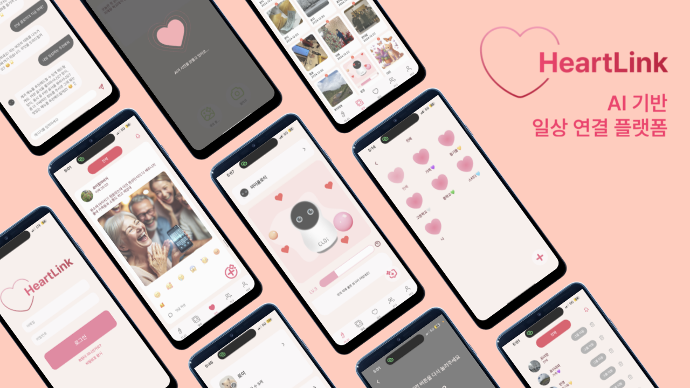

# 💖 HeartLink
**An AI Family Platform for Rebuilding Connection**  
- Connect generations through voice recognition and AI-enhanced social networking!

  
  
## 🎥 Demo Video (🔗 Click Below!)
🔗 TBD
  
## 📌 Proposal
HeartLink is a group-centric SNS platform that breaks down intergenerational communication barriers through a voice interface. Its real-time group feed feature converts AI voice recognition into text and generates images based on that text, allowing users to easily share their daily lives through simple voice inputs. This is particularly beneficial for elderly users who are less familiar with digital devices, enabling them to communicate naturally. HeartLink’s mission is to bridge family communication gaps and foster meaningful connections. Additionally, the platform features a virtual pet, CLOi, that grows in level based on SNS activity and interacts with users like a generative chatbot. Accessible through LG StandbyME, HeartLink combines cutting-edge AI technology with the warmth of family and friendship connections.
  
HeartLink은 음성 인터페이스를 통해 세대 간의 소통 장벽을 허물어주는 그룹 중심의 SNS 플랫폼입니다. 이 플랫폼의 실시간 그룹 피드 기능은 AI 음성 인식을 텍스트로 변환하고, 해당 텍스트를 기반으로 이미지를 생성하여 사용자들이 간단한 음성 입력만으로 일상을 쉽게 공유할 수 있도록 돕습니다. 이는 디지털 기기에 익숙하지 않은 고령 사용자들에게 특히 유용하며, 자연스러운 소통을 가능하게 합니다. HeartLink의 사명은 가족 간의 소통 격차를 줄이고, 의미 있는 연결을 강화하는 데 있습니다. 또한, 플랫폼은 SNS 활동에 따라 성장하며 챗봇 형식으로 대화를 할 수 있는 가상 펫 CLOi를 제공합니다. LG StandbyME를 통해 접근할 수 있는 HeartLink는 최첨단 AI 기술을 통해 가족 및 친구의 따뜻한 연결을 위한 새로운 소통 플랫폼입니다.
     
## 🌟 Main Functions
👉 **Group Feeds**: AI-powered voice-to-text & image generation  
  
👉 **Archives**: Personal and group post archives for sharing memories  
  
👉 **Virtual Pet - CLOi**: Encourage SNS participation and interaction through an evolving AI pet  
  
👉 **Shared Albums**: Easily organize and share group photos  
  
👉 **Friend & Group Management**: Build connections with family and friends
  
   
## 💻 Architecture Structure

   
## 🙋🏻‍♂️ Group Members
| Name            | Department                                | Location                 | Email                       |
|------------------|------------------------------------------|--------------------------|-----------------------------|
| Jeong Yeonkyung | Dept. of Information Systems, Hanyang University | Seoul, Republic of Korea | edaily0129@gmail.com        |
| Kim Dayeon       | Dept. of Information Systems, Hanyang University | Seoul, Republic of Korea | jewelry0706@hanyang.ac.kr   |
| Park Jeongho     | Dept. of Information Systems, Hanyang University | Seoul, Republic of Korea | popramel@hanyang.ac.kr      |
| Yu Jihye         | Dept. of Information Systems, Hanyang University | Seoul, Republic of Korea | jihyeyu33@hanyang.ac.kr     |
    
### 🔗 Links
🔗 **Notion**: TBD  
🎨 **Figma**: https://www.figma.com/design/pWLXJosrBwKVW7n35S9YfL/2024-2-SE_HeartLink?node-id=1-5&t=JhY1tghOwMr3WjJo-1  
🖥️ **GitHub Repository**: https://github.com/CSE24-HeartLink

