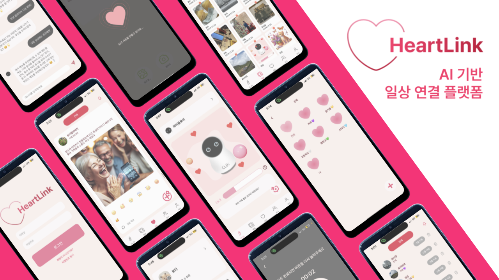
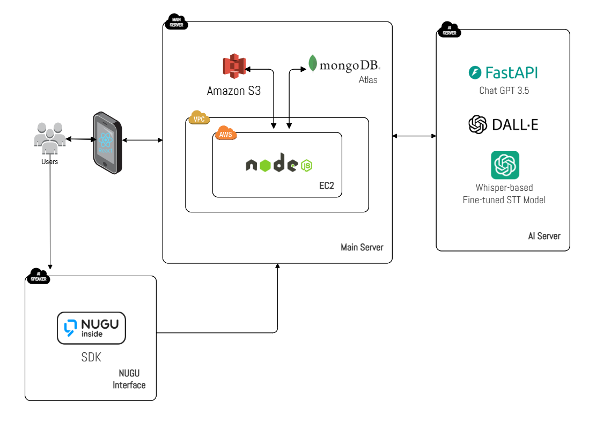
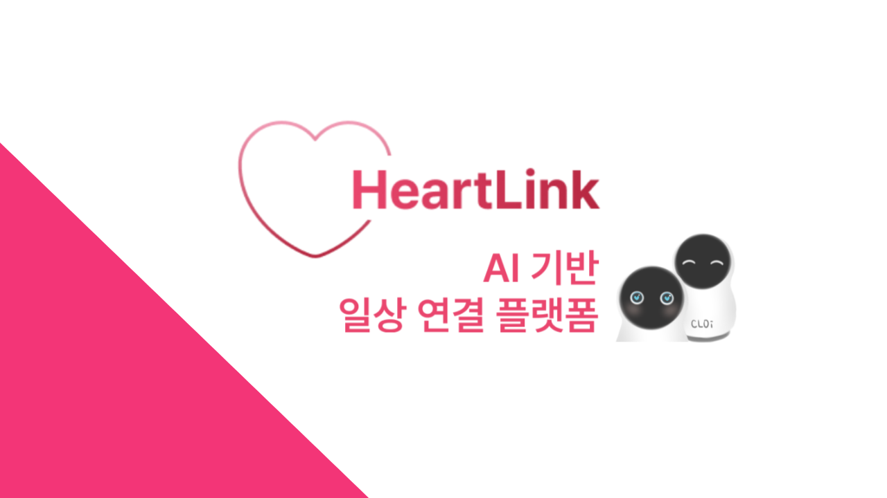

# 💖 HeartLink
**An AI Family Platform for Rebuilding Connection**  
Connect generations through voice recognition and AI-enhanced social networking!

  
  
## 🎥 Demo Video (🔗 Click Below!)
🔗 **App Demo Video** : https://youtu.be/94qOdVWQj_8

🔗 **LG StandbyME x NUGU Demo Video** : https://youtu.be/ExzJVdnNvAs

🔗 **LG StandbyME x NUGU Scenario Video** : https://youtu.be/n3aJk-IJuhE
  

## 📌 Proposal
HeartLink is a group-centric SNS platform that breaks down intergenerational communication barriers through a voice interface. Its real-time group feed feature converts AI voice recognition into text and generates images based on that text, allowing users to easily share their daily lives through simple voice inputs. This is particularly beneficial for elderly users who are less familiar with digital devices, enabling them to communicate naturally. HeartLink’s mission is to bridge family communication gaps and foster meaningful connections. Additionally, the platform features a virtual pet, CLOi, that grows in level based on SNS activity and interacts with users like a generative chatbot. Accessible through LG StandbyME, HeartLink combines cutting-edge AI technology with the warmth of family and friendship connections.
  
HeartLink은 음성 인터페이스를 통해 세대 간의 소통 장벽을 허물어주는 그룹 중심의 SNS 플랫폼입니다. 이 플랫폼의 실시간 그룹 피드 기능은 AI 음성 인식을 텍스트로 변환하고, 해당 텍스트를 기반으로 이미지를 생성하여 사용자들이 간단한 음성 입력만으로 일상을 쉽게 공유할 수 있도록 돕습니다. 이는 디지털 기기에 익숙하지 않은 고령 사용자들에게 특히 유용하며, 자연스러운 소통을 가능하게 합니다. HeartLink의 사명은 가족 간의 소통 격차를 줄이고, 의미 있는 연결을 강화하는 데 있습니다. 또한, 플랫폼은 SNS 활동에 따라 성장하며 챗봇 형식으로 대화를 할 수 있는 가상 펫 CLOi를 제공합니다. LG StandbyME를 통해 접근할 수 있는 HeartLink는 최첨단 AI 기술을 통해 가족 및 친구의 따뜻한 연결을 위한 새로운 소통 플랫폼입니다.
  
     
## 🤖 Main Function : AI Auto-Generated Feeds
HeartLink is an AI-driven social networking platform that allows users to more easily record and share their daily lives through automated feed generation features.

### 👉 Speech-to-Text (STT)

Utilizing HuggingFace's pre-trained Whisper model, HeartLink accurately converts users' speech to text. Through fine-tuning based on Korean language data, we reduced the error rate to approximately 4.3%.

### 👉 Image Generation

Using OpenAI's DALLE 3 model, HeartLink generates text-based images. The AI creates creative images in real-time based on user-input text.

### 👉 Upload Feeds by Voice

By connecting with NUGU speaker, users can create and share posts using just voice commands, while AI automatically generates and uploads text and images to group feeds. The entire workflow is AI-orchestrated, requiring minimal user intervention.

---

## 💬 SNS Functions

👭 **Group Management and Communication**

- **Group Feeds**: Users can upload and share AI-generated text and images within groups.
- **Friend and Group Management**: Enables efficient relationship management with features like friend requests and group creation/deletion.
- **Group Album**: Organizes photos shared by group members into a unified album, making it easier to capture and relive memories.

📁 **Post Archive and Management** 

- **Archives**: A space where personal and group posts are organized chronologically and stored.
  - Easily find past posts and systematically manage own important moments.

🤖 **CLOi: Virtual Pet & Chatbot**

- **CLOi**: A virtual pet that evolves through social media interactions, enhancing emotional connection with users.
- **Chatbot**: Delivers natural conversational experiences through CLOi, a chatbot powered by OpenAI's ChatGPT-3.5-turbo model.
  
   
## 💻 Architecture Structure

  
   
## 🙋🏻‍♂️ Group Members
| Name            | Department                                | Role                   | Email                       |
|------------------|------------------------------------------|--------------------------|-----------------------------|
| Jeong Yeonkyung | Dept. of Information Systems, Hanyang University | PM, Back-End developer| edaily0129@gmail.com        |
| Kim Dayeon       | Dept. of Information Systems, Hanyang University | Front-End developer, Designer | jewelry0706@hanyang.ac.kr   |
| Park Jeongho     | Dept. of Information Systems, Hanyang University | Front-End developer | popramel@hanyang.ac.kr      |
| Yu Jihye         | Dept. of Information Systems, Hanyang University | AI developer | jihyeyu33@hanyang.ac.kr     |

### 🔗 Links
🔗 **Notion**: https://phase-factory-0d0.notion.site/HEARTLINK-b8a6b9b84cc746a0903ce51631655fdd  
🎨 **Figma**: https://www.figma.com/design/pWLXJosrBwKVW7n35S9YfL/2024-2-SE_HeartLink?node-id=1-5&t=JhY1tghOwMr3WjJo-1  
🖥️ **PPT**: https://www.miricanvas.com/v/13zwjdu

